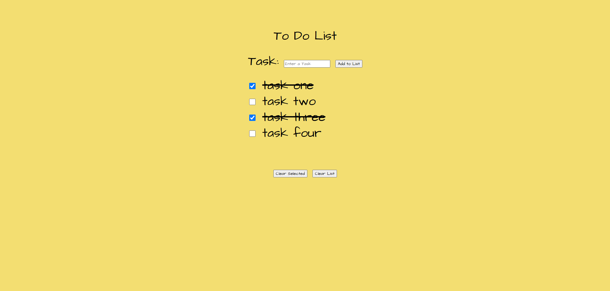

# Simple to Do List Site

Link to project: (https://simpletodolisttracker.netlify.app/)

## How It's Made:
Tech used: HTML, CSS, JS

A simple to do list website that allows users to type in tasks, cross them off once completed, clear selected tasks, and clear all tasks. 

The site utilizes JavaScript to grab all of the user inputted items from the DOM, and adds a CSS class to a specific item if the user clicks its corresponding checkbox, effectively crossing it out. The clear selected button loops through all of the checked items, and removes them from the DOM if they are checked. The clear all button clears the list of items entirely.

## Optimizations

The JavaScript consists of multiple smaller functions that are called within each other as helper functions, to isolate the impact of changes. This allows for easy updating should anything break.

## Lessons Learned

One of the most important things I picked up from this project was accounting for cases where a user tries to add a list item without providing a value in the input. To correct this, I created a conditional to see if the input value is an empty string - if it is, do not allow the user to submit the list item. This prevents an empty list item and checkbox from being added to the list. 